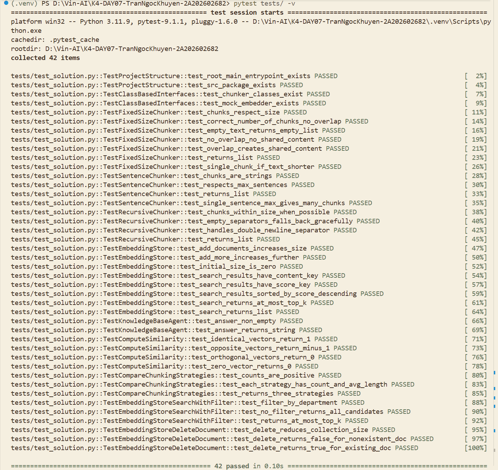

# Báo Cáo Cá Nhân — Lab 7: Embedding & Vector Store

**Họ tên:** Trần Ngọc Khuyến
**Nhóm:** Bacvuongtoiday
**Ngày:** 19/09/2026

> **Nộp 1 bản / sinh viên.** Phần nhóm (lựa chọn tài liệu, thiết kế chiến lược, bộ câu hỏi đánh giá, demo) nộp chung 1 bản trong `REPORT_NHOM.md`. Chi tiết thang điểm: `docs/SCORING.md`.

**Tổng điểm phần cá nhân: 60** = Khởi động (5) + Hướng tiếp cận (10) + Hoàn thiện code (30) + Dự đoán độ tương tự (5) + Kết quả truy xuất của tôi (10).

---

## 1. Khởi động (Warm-up) — Cá nhân (5 điểm)

### Độ tương tự Cosine (Cosine Similarity) (Bài tập 1.1)

**Độ tương tự cosine cao (High cosine similarity) nghĩa là gì?**
> Hai embedding có hướng gần nhau trong không gian vector, nên hai đoạn văn thường gần nhau về ý nghĩa. Điểm càng gần 1 thì mức tương đồng theo hướng vector càng cao.

**Ví dụ có độ tương tự CAO:**
- Câu A: Sinh viên đăng ký học lại để cải thiện điểm.
- Câu B: Người học đăng ký lớp học cải thiện điểm.
- Tại sao tương đồng: Hai câu dùng từ khác nhau nhưng cùng mô tả việc đăng ký học lại với mục đích cải thiện kết quả.

**Ví dụ có độ tương tự THẤP:**
- Câu A: Chứng chỉ ACCA có thể chuyển đổi sang học phần kế toán.
- Câu B: Thư viện mở cửa phòng đọc từ thứ Hai đến thứ Sáu.
- Tại sao khác: Hai câu nói về hai dịch vụ đại học không liên quan trực tiếp: chuyển đổi chứng chỉ và lịch phục vụ thư viện.

**Tại sao độ tương tự cosine (cosine similarity) được ưu tiên hơn khoảng cách Euclid (Euclidean distance) cho text embeddings?**
> Cosine quan tâm đến hướng của vector hơn độ lớn, nên phù hợp để so ý nghĩa của các văn bản có độ dài khác nhau. Khi embedding đã chuẩn hóa, dot product bằng cosine similarity, vì vậy search có thể tính nhanh bằng tích vô hướng.

### Bài toán tính toán Chunking (Bài tập 1.2)

**Tài liệu 10,000 ký tự, chunk_size=500, overlap=50. Bao nhiêu chunks?**
> *Trình bày phép tính:* (10000 - 50) / (500 - 50) = 9950 / 450 = 23.
> *Đáp án:* 23 chunks.

**Nếu độ chồng chéo (overlap) tăng lên 100, số lượng chunk thay đổi thế nào? Tại sao muốn độ chồng chéo nhiều hơn?**
> Số chunk tăng thành (10000 - 100) / (500 - 100) = 9900 / 400 = 25. Overlap lớn hơn giữ ngữ cảnh ở ranh giới chunk tốt hơn, nhưng tạo thêm chunk, tăng chi phí embedding/lưu trữ và dễ có kết quả lặp.

---

## 2. Hướng tiếp cận của tôi (My Approach) — Cá nhân (10 điểm)

Giải thích cách tiếp cận của bạn khi lập trình (implement) các phần chính trong gói `src`.

### Các hàm chia nhỏ (Chunking Functions)

**`SentenceChunker.chunk`** — hướng tiếp cận:
> Tôi dùng regex (?<=[.!?])\s+ để tách tại khoảng trắng sau dấu kết thúc câu mà vẫn giữ dấu câu trong câu phía trước. Text rỗng trả []; các câu được strip rồi gom theo max_sentences_per_chunk. Edge case chưa xử lý hoàn hảo là chữ viết tắt như TS., v.v. và số thập phân vì chúng có thể bị nhận nhầm là ranh giới câu.

**`RecursiveChunker.chunk` / `_split`** — hướng tiếp cận:
> Thuật toán ưu tiên '\n\n', '\n', '. ', khoảng trắng, rồi cắt theo ký tự khi cần. Mảnh dài hơn chunk_size được đệ quy với separator nhỏ hơn, còn các mảnh ngắn liền kề được gom lại đến sát giới hạn. Base case là mảnh đã đủ ngắn, hết separator, hoặc separator rỗng; hai trường hợp sau fallback sang cắt theo ký tự để không bị lặp vô hạn.

### Lớp EmbeddingStore

**`add_documents` + `search`** — hướng tiếp cận:
> Mỗi Document được lưu thành một record in-memory gồm id, content, metadata đã copy và embedding; add_documents không tự chunk. search embed query, tính dot product với từng embedding, sắp xếp score giảm dần và chỉ trả các trường cần đọc, không trả vector embedding.

**`search_with_filter` + `delete_document`** — hướng tiếp cận:
> search_with_filter lọc metadata trước rồi mới search để top-k không bị tài liệu sai chiếm chỗ. Record luôn có metadata['doc_id'] gốc; delete_document lọc bỏ toàn bộ chunk có doc_id khớp và trả True nếu có ít nhất một chunk bị xóa.

### Tác tử KnowledgeBaseAgent

**`answer`** — hướng tiếp cận:
> Agent lấy top-k chunks, đánh số [1], [2], [3] và kèm source_url hoặc doc_id vào context. Prompt yêu cầu LLM chỉ trả lời dựa trên context, báo thiếu thông tin khi cần và trích dẫn số chunk. Nếu store rỗng, agent trả thông báo ngay thay vì gọi LLM.

---

## 3. Hoàn thiện code (Core Implementation) — Cá nhân (30 điểm)

Vượt qua bộ kiểm thử là điều kiện tính điểm phần này.

### Kết Quả Kiểm Thử (Test Results)

```
# Dán kết quả (output) của: pytest tests/ -v
```


**Số lượng bài test vượt qua (pass):** 42 / 42

---

## 4. Dự đoán độ tương tự (Similarity Predictions) — Cá nhân (5 điểm)

| Cặp | Câu A | Câu B | Dự đoán | Điểm thực tế | Đúng? |
|------|-----------|---------|--------------|-------|---|
| 1 | Sinh viên đăng ký học lại để cải thiện điểm. | Người học đăng ký lớp học cải thiện điểm. | cao | -0.1105 | Không |
| 2 | Điều kiện xét học bổng yêu cầu kết quả học tập khá. | Muốn nhận học bổng cần thành tích học tập đạt yêu cầu. | cao | -0.0900 | Không |
| 3 | Kỳ thi chuẩn đầu ra tiếng Anh tổ chức vào tháng Chín. | Lịch thi tiếng Anh đầu ra diễn ra ngày 12 và 13 tháng 9. | cao | 0.2285 | Có, nhưng thấp |
| 4 | Chứng chỉ ACCA có thể chuyển đổi sang học phần kế toán. | Thư viện mở cửa phòng đọc từ thứ Hai đến thứ Sáu. | thấp | 0.0320 | Có |
| 5 | Tư vấn chuyên ngành cho sinh viên khóa 2024. | Buổi định hướng dành cho tân sinh viên khóa 2021. | thấp | 0.0053 | Có |

**Kết quả nào bất ngờ nhất? Điều này nói gì về cách embeddings biểu diễn ý nghĩa?**
> Cặp 1 và 2 có cùng ý nghĩa nhưng điểm lại âm. Lý do là điểm thực tế được đo bằng _mock_embed, vốn sinh vector từ MD5 chứ không biểu diễn ngữ nghĩa. Kết quả cho thấy mock chỉ phù hợp để test cấu trúc; benchmark retrieval cần LocalEmbedder đa ngữ hoặc API embedding thật.

---

## 5. Kết quả truy xuất của tôi (Competition Results) — Cá nhân (10 điểm)

Chạy **5 câu hỏi đánh giá của nhóm** trên mã nguồn cá nhân của bạn trong gói `src`. **5 câu hỏi này phải trùng với các thành viên cùng nhóm** (xem `REPORT_NHOM.md`).

| # | Câu hỏi (Query) | Top-1 Chunk truy xuất được (tóm tắt) | Điểm Score | Có liên quan không? (Relevant) | Câu trả lời của Agent (tóm tắt) |
|---|-------|--------------------------------|-------|-----------|------------------------|
| 1 | Hạn cuối để đăng ký nguyện vọng học lại cải thiện điểm là khi nào? | lop-dau-khoa (không liên quan) | 0.3661 | Không | Context không có mốc 25/09–29/09/2026; agent phải từ chối. |
| 2 | Nguyên tắc ưu tiên khi mở các lớp học lại là gì? | chuan-dau-ra-av (không liên quan) | 0.2019 | Không | Context không có điều kiện 5 sinh viên; agent phải từ chối. |
| 3 | Ngành CNKT Điện, điện tử được chia thành những chuyên ngành nào? | lop-dau-khoa (không liên quan) | 0.3752 | Không | Context không có hai chuyên ngành gold; agent phải từ chối. |
| 4 | Khi đăng ký học lại trên qldt, SV nhập gì vào ô Môn học? | tuvan-khoa23 (không liên quan) | 0.2970 | Không | Context không có “Mã môn”; agent phải từ chối. |
| 5 | Buổi tư vấn chọn chuyên ngành diễn ra ở phòng nào và lúc mấy giờ? | hoc-bong (không liên quan) | 0.2875 | Không | Baseline mock không trả gold chunk; kết quả semantic/A-B chính thức dùng số liệu tổng hợp của nhóm. |

**Bao nhiêu câu hỏi trả về chunk có liên quan trong top-3?** 0 / 5 với `_mock_embed`; xem `ket_qua_benchmark.txt`. Đây chỉ là baseline cục bộ, không dùng để so sánh score với lần chạy semantic tổng hợp của nhóm.

**Điều hay nhất tôi học được từ thành viên khác / nhóm khác (qua demo):**
> Metadata chỉ hữu ích nếu tách dữ liệu theo đúng chiều cần phân biệt. Tôi phân biệt rõ baseline `_mock_embed` cục bộ với kết quả semantic/A-B do nhóm tổng hợp, vì hai cấu hình không thể dùng chung để kết luận hiệu quả filter. Tôi cũng học được rằng phải làm sạch output crawl và dùng semantic embedder trước khi đánh giá retrieval, vì mock embedding không có ý nghĩa ngữ nghĩa.

---

## Tự Đánh Giá (Phần Cá Nhân)

| Tiêu chí | Điểm tự đánh giá |
|----------|-------------------|
| Khởi động (Warm-up) | 5 / 5 |
| Hướng tiếp cận của tôi | 10 / 10 |
| Hoàn thiện code (Core Implementation — tests) | 30 / 30 |
| Dự đoán độ tương tự (Similarity Predictions) | 5 / 5 |
| Kết quả truy xuất (Competition Results) | 0 / 10 (baseline mock, chưa chấm cuối) |
| **Tổng phần cá nhân** | **50 / 60 (tạm tính)** |
